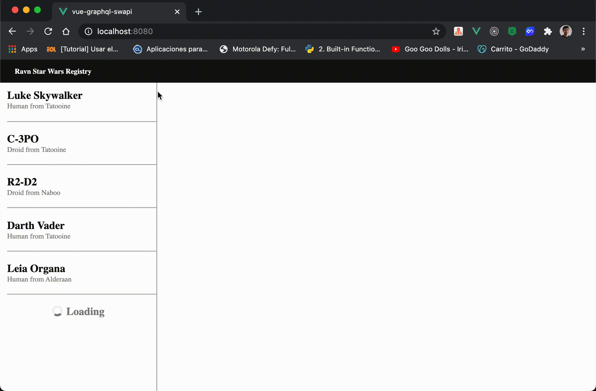

# vue-graphql-swapi

A simple Star Wars web app using Vue and GraphQL Apollo Client.

The design is bases in [this figma project](https://www.figma.com/file/Ceoqa8DbrtyKoOBDR77ktm/Ravn-Code-Challenge?node-id=34%3A0).



## Project setup

Go to the project:

```
cd vue-graphql-swapi
```

And install dependencies:

```
npm install
```

### Compiles and hot-reloads for development

To run in developmento mode, use the following command:

```
npm run serve
```

### Compiles and minifies for production

```
npm run build
```

Next, open the `dist/index.html` file in your preferred browser

### Lints and fixes files

```
npm run lint
```
